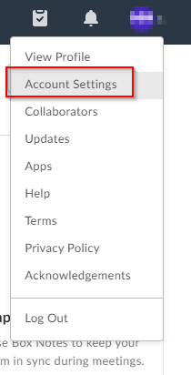
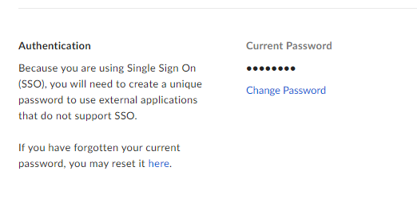

# boxy
 Native python API to access Box.com FTP


## Install

This package has not yet been published to PyPi but can be installed directly by referencing the URL to the latest version on Github. 

See: [Github Releases](https://github.com/mmongeon-sym/boxy/releases)

#### Install from Github (Latest Version)
```bash
pip install https://github.com/mmongeon-sym/boxy/releases/latest/download/boxy.tar.gz
```
or 

#### Uninstall
```bash
pip uninstall boxy -y
```


## Requirements

##### Python 3.7+
This library makes heavy use of Python 3.7+ builtin Data Classes library. See [PEP 557](https://www.python.org/dev/peps/pep-0557/)

##### Box.com SSO Application Password

Box.com SSO users will need to create an `SSO Application Password` to be able to connect to the Box.com FTP. 

1. Login to your Box.com account 
2. In the top-right of the Box interface, click on your username. 
3. Navigate to `Account Settings`


4. Under `Authentication` create your `SSO Application Password`. 



## Usage

### Import
```bash
from boxy import BoxFTP
```

### Connect

#### BoxFTP(username: str, password: str): Connect to the Box.com FTP 
```python
username = 'email@domain.com'
password = 'SECRET_PASSWORD'

box = BoxFTP(
         username=username,
          password=password,
          timeout=120
         )
```
#### BoxFTP.file(path: str): Return a BoxFile object based on the provided Path
```python
box.file(path='/test_box_folder/test_file.csv')
```

#### To-Do

* Add upload_from_df method
* Add upload_to_azure
*